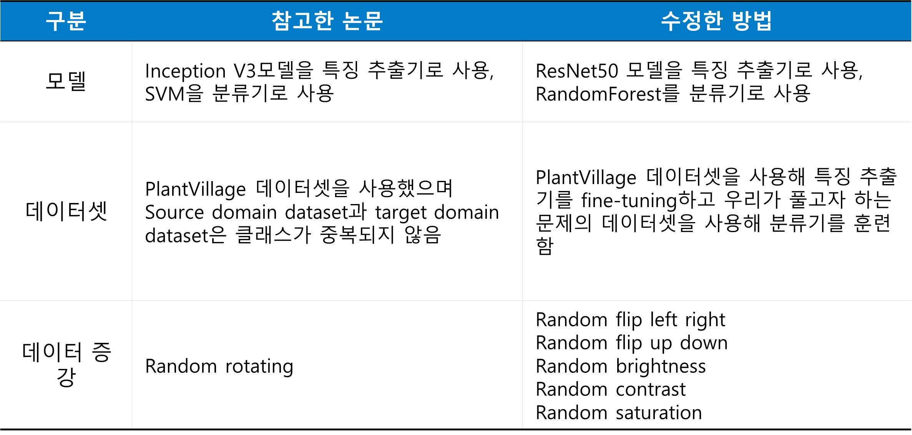
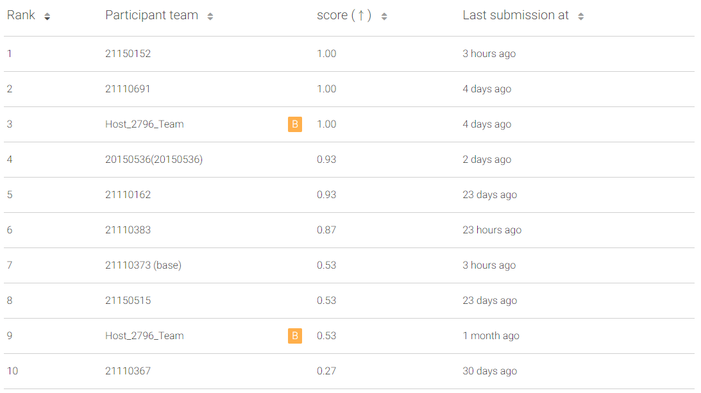

# 2021ComputerVision-Stage 3-Plant Disease Augmentation Classification


## 동영상

Plant Disease Augmentation Classification Challenge를 사용해 텀 프로젝트 3단계를 진행한 과정을 설명한 동영상은 아래 링크를 통해 확인할 수 있습니다.

- [Youtube](https://youtu.be/iavCN_t3tVk)

  

## 환경구축

```
conda create --name tf2_5 python=3.9
conda install -c anaconda tensorflow-gpu
pip install matplotlib
pip install pandas
```


## 참고한 논문

- [Few-Shot Learning approach for plant disease classification using images taken in the field](https://www.sciencedirect.com/science/article/pii/S0168169920302544)

- 참고한 논문과 텀 프로젝트를 진행하기 위해 사용한 방법의 차이점(아이디어)

  

## 코드 설명

- convert_image_format: 다양한 format의 이미지를 모두 PNG format의 이미지로 formatting함
- anchor_pos_neg_gen.ipynb: Triplet loss를 사용해 siamese network을 fine-tuning하기 위한 anchor, positive, negative image set 준비
- siamese_network.ipynb: Triplet loss를 사용해 siamese network을 fine-tuning하는 코드
- svm_classifier: fine-tuning한 특징 추출기를 이용해 추출한 특징을 사용해 분류기를 훈련하고 결과를 예측하는 코드

## 리더보드 업로드 결과

훈련한 모델을 사용해 예측을 진행한 결과를 Leader board에 업로드하여 성능을 측정했을 때 baseline 성능보다 높은 93%의 정확도를 기록함

